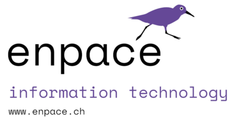

# Enpace AG – Information Technology

**Enpace AG** was founded in 2021 with a simple goal: help you operate your IT in an effective and modern way.  
We provide consulting, implementation and support across cloud solutions, DevOps, IT automation, configuration management and monitoring.

---

## 🚀 Who we are  
Based in Villnachern, Switzerland (Bäumliackerweg 2a, 5213 Villnachern).  
We combine deep technical expertise with pragmatic implementation — enabling you to focus on your business, not your infrastructure.

---

## 🧭 What we do

### 🛠 IT Automation  
We help you operate your IT infrastructure and applications in a comprehensible, secure and documented way.  
Your CMDB (Configuration Management Database) becomes the foundation for deployment and operations.  
We automate across platforms — whether Windows, Linux or Kubernetes.

### 📈 Monitoring  
We support you in monitoring your IT systems, services and applications comprehensively.  
We are product-agnostic and bring years of experience across Windows, Linux, Kubernetes, Azure and more.

### 🧑‍💻 Open-Source Software  
At Enpace, we actively share tools that make IT automation and operations easier.

#### [Pharos](https://github.com/metraction/pharos)  

**Pharos** is an open-source monitoring and visualization system.  
It helps teams build clear, observable infrastructure by combining metrics, topology and visual dashboards in one cohesive platform.

#### [Yadox](https://github.com/enpace/yadox)  

**Yadox** (YAML + Docs) is a command-line tool that generates documentation from YAML files.  
It helps teams maintain consistent, human-readable documentation for configuration-driven environments.  
Perfect for DevOps workflows, Ansible roles and cloud-native projects.

### 💡 Custom Software Development  
We build bespoke software solutions.  
Our stack includes **Go** and **.NET** for backend development, and modern front-end frameworks such as **Angular** and **Vue**.  
We focus on maintainable, scalable enterprise solutions.

## 🧩 Services at a glance  

| Area                      | Highlights                                                  |
|----------------------------|-------------------------------------------------------------|
| Cloud Solutions            | Design, migration, optimisation                             |
| DevOps & CI/CD             | Pipelines, infrastructure as code                           |
| Configuration Management   | CMDB, standardisation, documentation                        |
| Monitoring & Observability | Systems, services, applications across platforms            |
| Software Development       | Backend (Go, .NET), Front-end (Angular, Vue)               |

---

## 📬 Get in touch  

**Enpace AG**  
📍 Bäumliackerweg 2a, 5213 Villnachern, Switzerland  
📞 +41 56 442 55 55  
✉️ [info@enpace.ch](mailto:info@enpace.ch)  
🌐 [https://www.enpace.ch](https://www.enpace.ch)

---

